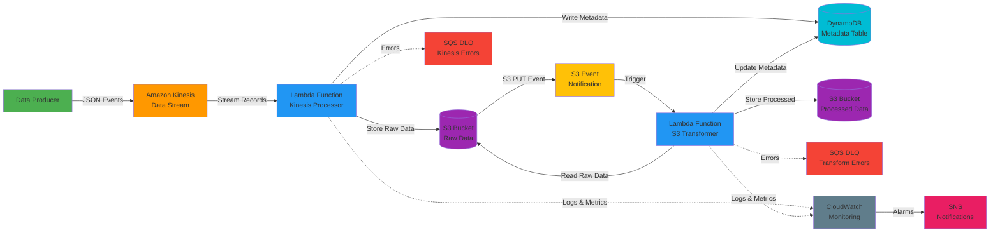

# AWS Project Challenge 5 – Event-Driven Data Pipeline with S3, Lambda & Kinesis

## 🎯 Project Overview

A production-ready, real-time data processing pipeline that demonstrates event-driven architecture using AWS services. This project ingests streaming data via Amazon Kinesis Data Streams, processes it with AWS Lambda functions, and stores transformed data in Amazon S3.

## 🏗️ Architecture



### Architecture Components

- **Data Producer**: Python application generating sample events
- **Kinesis Data Stream**: Real-time data ingestion with configurable shards
- **Lambda Processors**: Serverless functions for stream processing and transformation
- **S3 Buckets**: Data lake storage with partitioning (raw & processed)
- **DynamoDB**: Metadata tracking and state management
- **CloudWatch**: Centralized logging, metrics, and alarms
- **SQS DLQ**: Dead Letter Queues for error handling and retry mechanisms

## 🚀 Features

- **Real-time Stream Processing**: Ingest and process data streams using Kinesis
- **Event-Driven Architecture**: Automatic Lambda triggers from Kinesis and S3
- **Data Transformation**: Multi-stage processing pipeline with validation
- **Error Handling**: Dead Letter Queues (DLQ) and retry mechanisms
- **Monitoring**: CloudWatch metrics, logs, and alarms
- **Infrastructure as Code**: Complete Terraform configuration
- **Scalability**: Auto-scaling Lambda and Kinesis shards

## 📋 Prerequisites

- AWS Account with appropriate permissions
- AWS CLI configured (`aws configure`)
- Terraform >= 1.0
- Python 3.9+
- Node.js 18+ (for deployment scripts)

## 🛠️ Tech Stack

- **AWS Kinesis Data Streams**: Real-time data ingestion
- **AWS Lambda**: Serverless compute for data processing
- **Amazon S3**: Data lake storage
- **Amazon DynamoDB**: Metadata and state management
- **Amazon CloudWatch**: Monitoring and alerting
- **AWS IAM**: Security and access control
- **Terraform**: Infrastructure as Code

## 📁 Project Structure

```
.
├── README.md
├── architecture/
│   ├── architecture-diagram.png
│   └── data-flow.md
├── infrastructure/
│   ├── terraform/
│   │   ├── main.tf
│   │   ├── variables.tf
│   │   ├── outputs.tf
│   │   ├── kinesis.tf
│   │   ├── lambda.tf
│   │   ├── s3.tf
│   │   ├── dynamodb.tf
│   │   ├── iam.tf
│   │   └── cloudwatch.tf
│   └── cloudformation/
│       └── template.yaml
├── lambda/
│   ├── kinesis-processor/
│   │   ├── handler.py
│   │   ├── requirements.txt
│   │   ├── config.py
│   │   └── tests/
│   ├── s3-transformer/
│   │   ├── handler.py
│   │   ├── requirements.txt
│   │   ├── config.py
│   │   └── tests/
│   └── layers/
│       └── common/
│           ├── python/
│           └── requirements.txt
├── data-producer/
│   ├── producer.py
│   ├── sample_data.json
│   ├── requirements.txt
│   └── config.yaml
├── scripts/
│   ├── deploy.sh
│   ├── test-pipeline.sh
│   ├── cleanup.sh
│   └── monitor.sh
├── tests/
│   ├── integration/
│   └── unit/
├── docs/
│   ├── setup-guide.md
│   ├── deployment.md
│   ├── troubleshooting.md
│   └── api-reference.md
└── .gitignore
```

## 🚦 Quick Start

### 1. Clone and Setup

```bash
cd final_aws_project_6
pip install -r data-producer/requirements.txt
```

### 2. Configure AWS Credentials

```bash
aws configure
# Enter your AWS Access Key ID, Secret Access Key, and Region
```

### 3. Deploy Infrastructure

```bash
cd infrastructure/terraform
terraform init
terraform plan
terraform apply
```

### 4. Deploy Lambda Functions

```bash
cd ../../scripts
./deploy.sh
```

### 5. Test the Pipeline

```bash
# Start the data producer
python data-producer/producer.py --config data-producer/config.yaml

# Monitor the pipeline
./scripts/monitor.sh
```

## 📊 Data Flow

1. **Data Ingestion**: Producer sends JSON events to Kinesis Data Stream
2. **Stream Processing**: Lambda function processes Kinesis records in batches
3. **Raw Storage**: Processed data stored in S3 raw bucket with partitioning
4. **Metadata Tracking**: Event metadata stored in DynamoDB
5. **S3 Event Trigger**: S3 PUT event triggers transformer Lambda
6. **Data Transformation**: Lambda enriches and transforms data
7. **Final Storage**: Transformed data stored in S3 processed bucket

## 🔧 Configuration

### Environment Variables

```bash
# Kinesis Configuration
KINESIS_STREAM_NAME=data-pipeline-stream
KINESIS_SHARD_COUNT=2

# S3 Configuration
RAW_BUCKET_NAME=data-pipeline-raw
PROCESSED_BUCKET_NAME=data-pipeline-processed

# DynamoDB Configuration
METADATA_TABLE_NAME=pipeline-metadata

# Lambda Configuration
LAMBDA_MEMORY=512
LAMBDA_TIMEOUT=60
```

### Terraform Variables

Edit `infrastructure/terraform/terraform.tfvars`:

```hcl
aws_region = "us-east-1"
environment = "dev"
project_name = "event-driven-pipeline"
kinesis_shard_count = 2
lambda_memory_size = 512
lambda_timeout = 60
```

## 📈 Monitoring

### CloudWatch Dashboards

- **Stream Metrics**: Incoming records, processing latency
- **Lambda Metrics**: Invocations, errors, duration, throttles
- **S3 Metrics**: Object counts, storage size

### CloudWatch Alarms

- High error rate (>5%)
- Lambda throttling
- Kinesis iterator age (>1 minute)
- DLQ message count

### Logs

```bash
# View Kinesis processor logs
aws logs tail /aws/lambda/kinesis-processor --follow

# View S3 transformer logs
aws logs tail /aws/lambda/s3-transformer --follow
```

## 🧪 Testing

### Unit Tests

```bash
cd lambda/kinesis-processor
python -m pytest tests/
```

### Integration Tests

```bash
cd tests/integration
python test_pipeline.py
```

### Load Testing

```bash
python data-producer/producer.py --rate 1000 --duration 300
```

## 🔒 Security Best Practices

- ✅ Least privilege IAM roles for Lambda functions
- ✅ S3 bucket encryption at rest (AES-256)
- ✅ Kinesis data encryption in transit
- ✅ VPC endpoints for private connectivity
- ✅ CloudTrail logging enabled
- ✅ Secrets stored in AWS Secrets Manager

## 💰 Cost Optimization

- **Kinesis**: Use on-demand mode for variable workloads
- **Lambda**: Right-size memory and timeout settings
- **S3**: Use Intelligent-Tiering for cost savings
- **DynamoDB**: Use on-demand billing for unpredictable traffic
- **CloudWatch**: Set log retention policies

### Estimated Monthly Cost (Low Traffic)

- Kinesis Data Stream: $15-30
- Lambda: $5-15
- S3: $5-10
- DynamoDB: $2-5
- **Total**: ~$30-60/month

## 🐛 Troubleshooting

### Common Issues

**Lambda timeout errors**
```bash
# Increase timeout in terraform/variables.tf
lambda_timeout = 120
```

**Kinesis iterator age increasing**
```bash
# Increase shard count or Lambda concurrency
kinesis_shard_count = 4
```

**S3 permission errors**
```bash
# Verify IAM role permissions
aws iam get-role-policy --role-name lambda-execution-role --policy-name s3-access
```

See [docs/troubleshooting.md](docs/troubleshooting.md) for more details.

## 📚 Learning Resources

- [AWS Kinesis Documentation](https://docs.aws.amazon.com/kinesis/)
- [AWS Lambda Best Practices](https://docs.aws.amazon.com/lambda/latest/dg/best-practices.html)
- [Event-Driven Architecture Patterns](https://aws.amazon.com/event-driven-architecture/)

## 🎓 Skills Demonstrated

- ✅ Event-driven architecture design
- ✅ Real-time stream processing
- ✅ AWS Lambda development and optimization
- ✅ Infrastructure as Code (Terraform)
- ✅ S3 event notifications and lifecycle policies
- ✅ Kinesis Data Streams configuration
- ✅ CloudWatch monitoring and alerting
- ✅ Error handling and retry mechanisms
- ✅ Security best practices
- ✅ Cost optimization strategies

## 🔄 CI/CD Integration

This project includes GitHub Actions workflows for:
- Automated testing
- Terraform validation
- Lambda deployment
- Infrastructure updates

## 📝 License

MIT License - See LICENSE file for details

## 👤 Author

Built as part of AWS Project Challenge Series

## 🤝 Contributing

Contributions welcome! Please read CONTRIBUTING.md first.

## 📞 Support

For issues and questions:
- Open a GitHub issue
- Check the troubleshooting guide
- Review AWS documentation

---

**Note**: Remember to destroy resources when done testing to avoid unnecessary charges:
```bash
cd infrastructure/terraform
terraform destroy
```
